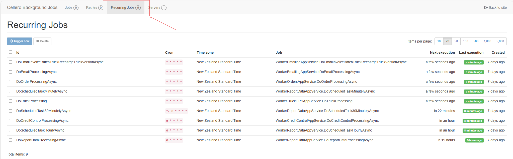

# Background Jobs

The system executes background jobs to automate tasks.  
Unlike App Automation, system automated tasks are not customisable.

 
 The schedule status can be view using the Background Job Dashboard:  

 

 The list of system background tasks is:  

| Task Name                                   | Frequency  |
|---------------------------------------------|------------|
| [DoCreditControlProcessing](DoCreditControlProcessing.md)                   | Hourly     |
| [DoEmailProcessing](DoEmailProcessing.md)                           | Minutely   |
| [DoEmailInvoiceBatchTruckRechargeTruckVersion](DoEmailInvoiceBatchTruckRechargeTruckVersion.md) | Minutely   |
| [DoOrderProcessing](DoOrderProcessing.md)                           | Minutely   |
| [DoTruckProcessing](DoTruckProcessing.md)                           | Minutely   |
