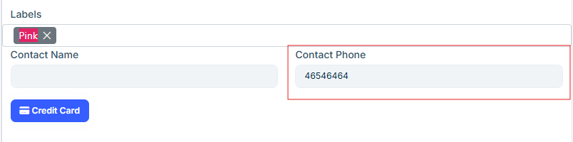

# Confirm Booking Alert
Automatically identifies unconfirmed orders and sends an SMS notification to customers, prompting them to confirm their orders proactively.

## Triggered by
Stored Procedure:  
App_ScheduledTask_Minutely_010_Confirm_Booking_Alert


## Criteria
- only sends after 9am
- fires every minute
- only sends maximum 1 message per plant per cycle
- only send once per order 
- only for up coming orders
- only if the order has a number in the contact phone

## Format
SMS via redcoal system

## Destination
Contact Number on Order:  
  
 

The number in the Contact Phone + @redcoal.net is the address used when sending the email

## Linked Stored Proc

````bash
App_ScheduledTask_Minutely_010_Confirm_Booking_Alert
````
